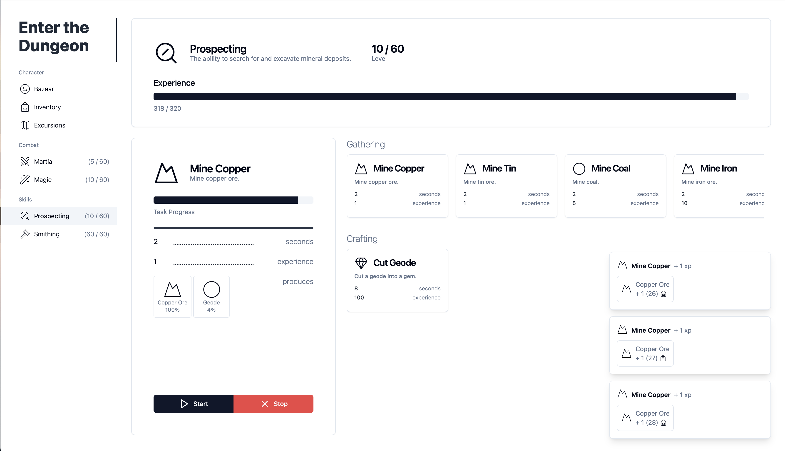
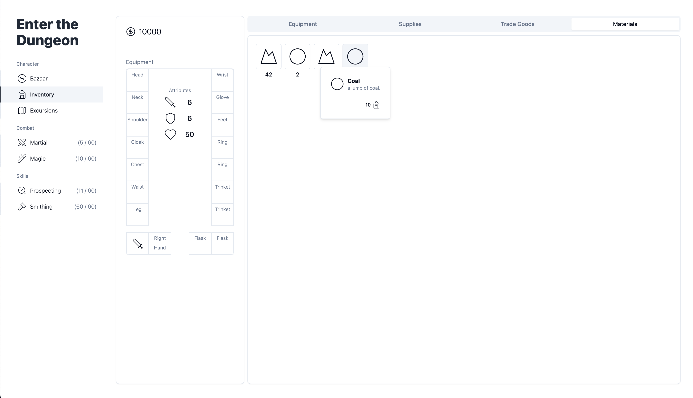

# Enter the Dungeon
## Summary & Screenshots
Enter the Dungeon is a rogue-lite with meta progression achieved through leveling up skills. It was developed late 2024 as a way to explore front end stacks and WAS compliance. I believe I will keep working on it! It draws inspiration from:

1. Runescape
2. Slay the Spire

Over the course of 3 weeks I went from making ugly square divs to something that looks like this and supports features such as

### 1. Skilling




### 2. Inventory management and collection



### FAQ
**Q. Why build a game using Typescript instead of C# / Unity?**
- The purpose was to expose me to modern frontend development using Typescript, Next and React. Making a game was a bonus!

**Q. How did you make the app look sleek with so little design experince?**
- I attribute this entirely to the ease of use of the [Shadcn/ui](https://ui.shadcn.com) component library and my reading through [RefactoringUI](https://www.refactoringui.com) by Adam Wathan (the creator of tailwind) and Steve Schoger.

## Tech Stack
The main components of the applications implementation

Game Features:
- Typescript & [Next / React](https://nextjs.org) - Game Engine

UX/UI:
- [Tailwind](https://tailwindcss.com) - UI Formatting
- [Lucide](https://lucide.dev/icons/) - Game icon library
- [Shadcn/ui](https://ui.shadcn.com) - Component library

Delivery:
- [Electron](https://www.electronjs.org) - Application packaging
- [GCP Firebase](https://firebase.google.com) - Game Backend

### Style
Code formatted using Prettier


## Getting Started
This is a [Next.js](https://nextjs.org/) project bootstrapped with [`create-next-app`](https://github.com/vercel/next.js/tree/canary/packages/create-next-app).

First, run the development server:

```bash
npm run dev
# or
yarn dev
# or
pnpm dev
# or
bun dev
```

Open [http://localhost:3000](http://localhost:3000) with your browser to see the result.

You can start editing the page by modifying `app/page.tsx`. The page auto-updates as you edit the file.

This project uses [`next/font`](https://nextjs.org/docs/basic-features/font-optimization) to automatically optimize and load Inter, a custom Google Font.

